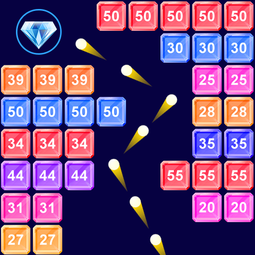
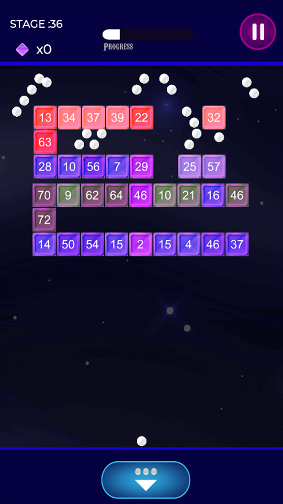
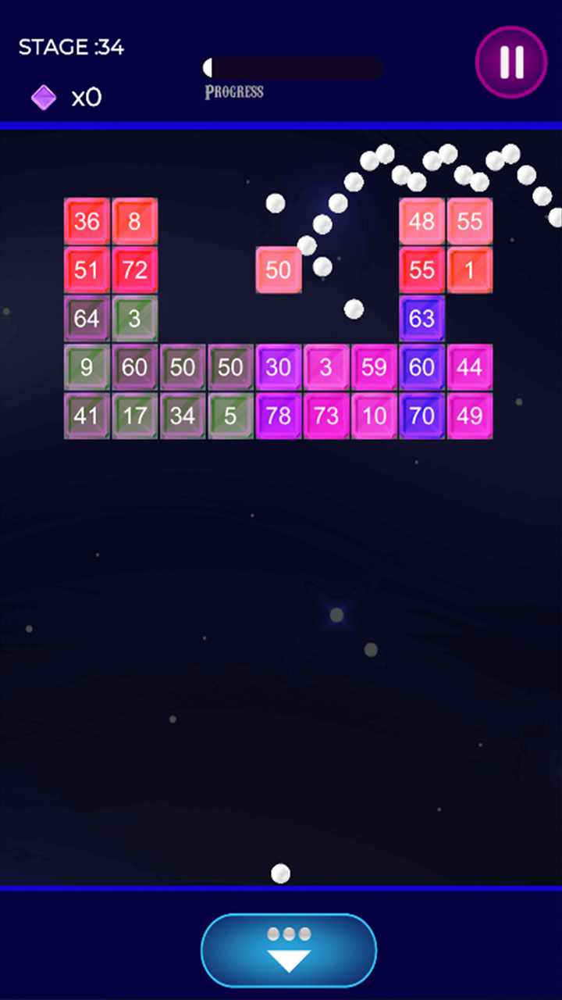
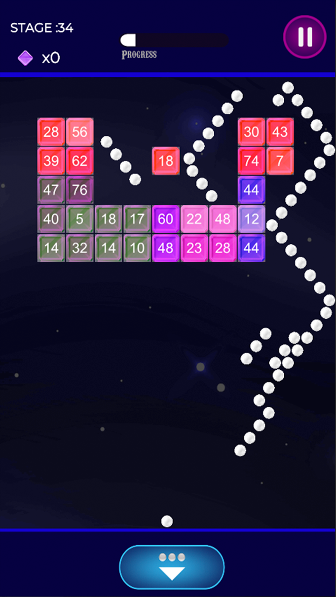
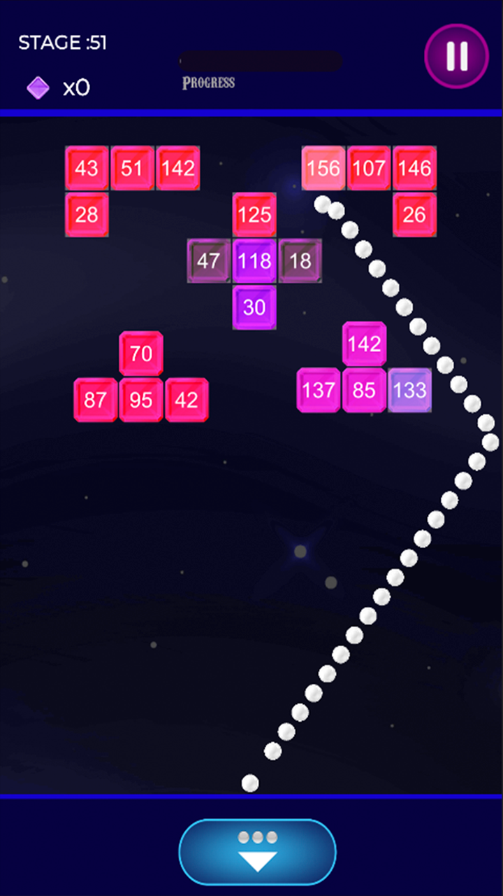
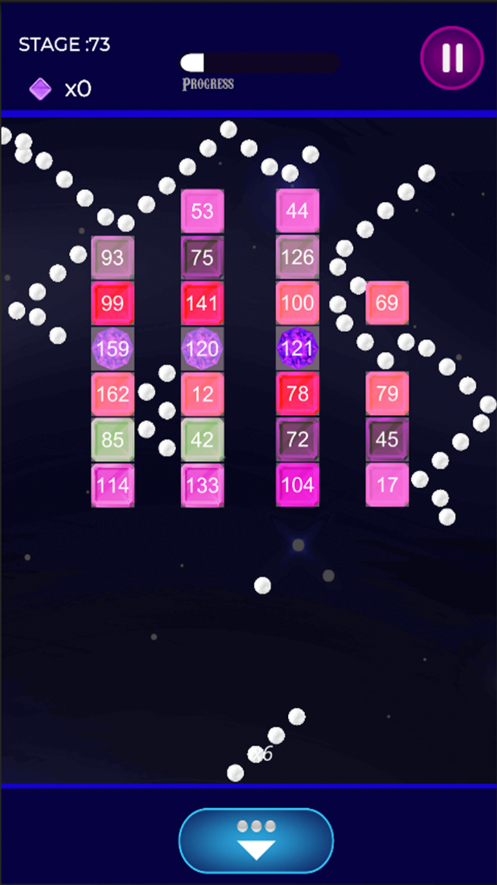

  <h1>Brick Breaker 2D</h1>
  

---

**Brick Breaker 2D** is an exciting arcade-style game that brings back the nostalgia of classic brick-breaking games. Control the paddle, bounce the ball, and destroy all the bricks to win. Get ready for hours of addictive gameplay and challenge your friends to beat your high score!

## Features

- **Classic Gameplay:** Experience the timeless joy of breaking bricks with a modern twist.

- **Multiple Levels:** Progress through increasingly challenging levels.

- **Power-Ups:** Collect power-ups and bonuses to enhance your gameplay.

- **High Score:** Compete with friends and aim for the top of the leaderboard.

- **Immersive Audio:** Enjoy the game with sound effects and music.
  
# How to Play

1. **Aim and Shoot:** To play Brick And Ball, simply hold your finger on the screen to aim in the direction you want to shoot.

2. **Break Bricks:** Release your finger to shoot the ball. Your objective is to break as many bricks as you can before they reach the bottom of the screen.

3. **Utilize Power-Ups:** Don't worry if you face challenges. The game provides various supportive items to help you clear levels. Collect these items to earn extra balls and make it easier to progress.

4. **Chain Reactions:** When the ball hits a brick, it creates a chain reaction, causing multiple bricks to break. Strategically plan your shots to maximize the impact.

5. **Complete Levels:** Your goal is to complete levels and compare your achievements with your friends. Can you conquer all the levels and become the ultimate Brick And Ball master?

## Features

- **One-Handed Gameplay:** Play with ease using just one finger for controls.

- **Relaxing Experience:** Take a break from your day and enjoy the game's stress-relieving gameplay.

- **100% Free:** Brick And Ball is a free-to-play puzzle game.

- **Precise Controls:** Easily control the aim of the balls to hit your targets accurately.

- **Numerous Levels:** Challenge yourself with a multitude of breaking bricks levels.

- **Engaging Gameplay:** Immerse yourself in the wonderful ball crusher experience.

- # Screenshots

Here are some screenshots of the Brick And Ball game:

1. **Screenshot 1**
   
   

2. **Screenshot 2**

   

3. **Screenshot 3**

   

4. **Screenshot 4**

   

5. **Screenshot 5**

   

Feel free to click on the screenshots to view them in full size and get a closer look at the gameplay.

---

Get ready to test your aiming skills and strategic thinking in **Brick And Ball**. Crush those bricks, break those records, and have a blast!
